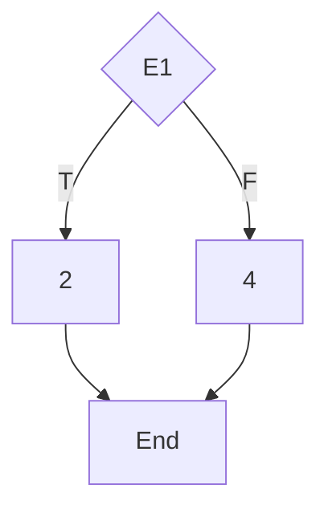

# Testing Simple Functions
## calculateMonthDays Function
### Dynamic White Box Unit Tests:
#### Condition
##### Cyclomatic Complexity:

```mermaid
flowchart TD
    A{E1} -->|T| B[2]
    A -->|F| C[4]
    B --> D[End]
    C --> D
```