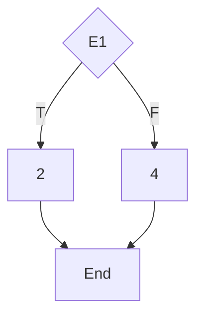
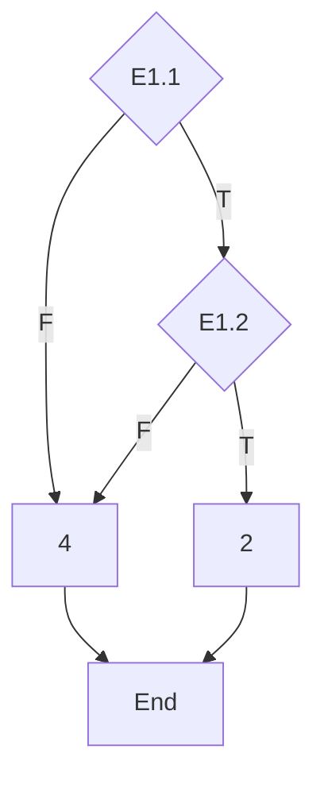
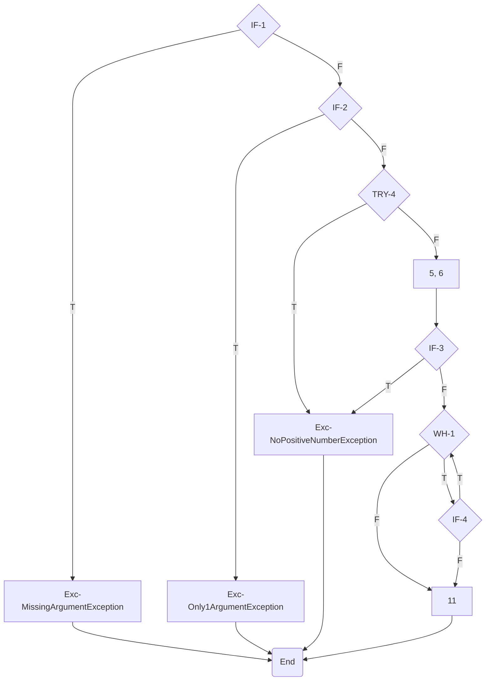

# Testing Simple Functions
## calculateMonthDays Function
### Dynamic White Box Unit Tests:
#### Condition
##### Cyclomatic Complexity:

##### Test Case Table:
| **\#case** | **Flow**      | **Condition**                     | **Input** | **Output** |
| ---------- | ------------- | --------------------------------- | --------- | ---------- |
| 1          | E1(T), 2, End | isLeapYear(year) && month == 2    | 2004, 1   | 29         |
| 2          | E1(F), 4, End | !(isLeapYear(year) && month == 2) | 2002, 1   | 28         |

#### Condition Decision
##### Cyclomatic Complexity:

##### Test Case Table:
| **\#case** | **Flow**                 | **Condition**                  | **Input** | **Output** |
| ---------- | ------------------------ | ------------------------------ | --------- | ---------- |
| 1          | E1.1(F), 4, End          | !isLeapYear(year) && year=*    | 2003, 0   | 31         |
| 2          | E1.1(T), E1.2(T), 2, End | isLeapYear(year) && month == 2 | 2004, 1   | 29         |
| 3          | E1.1(T), E1.2(F), 4, End | isLeapYear(year) && month != 2 | 2004, 0   | 31         |

## isPrime Function
### Dynamic White Box Unit Tests:
#### Condition
##### Cyclomatic Complexity:

##### Test Case Table:
| **\#case** | **Flow** (Conditions)                          | **Condition**    | **Input**          | **Output**                           |
| ---------- | ---------------------------------------------- | ---------------- | ------------------ | ------------------------------------ |
| 1          | IF-1(T)                                        | args == null     | args = null        | Exception: MissingArgumentException  |
| 2          | IF-1(F), IF-2(T)                               | args.length > 1  | args = {4, 12}     | Exception: Only1ArgumentException    |
| 3          | IF-1(F), IF-2(F), IF-3(T)                      | num < 0          | num = -4           | Exception: NoPositiveNumberException |
| 4          | IF-1(F), IF-2(F), IF-3(F), WH-1{0}             | num = 2          | num = 2            | True                                 |
| 5          | IF-1(F), IF-2(F), IF-3(F), WH-1{1} \[IF-4(F)\] | num = 3          | num = 3            | True                                 |
| 6          | IF-1(F), IF-2(F), IF-3(F), WH-1{1} \[IF-4(T)\] | num = 4          | num = 4            | False                                |
| 7          | IF-1(F), IF-2(F), IF-3(F), WH-1+               | num > 4          | num = 17           | True                                 |
| 8          | Exception: NoPositiveNumberException           | args\[0\] = NaN. | args\[0\] = "NaN." | Exception: NoPositiveNumberException |

## invert Function
### Dynamic Black Box Equivalence Partition and Limit Values Unit Tests:
#### Equivalence Partition Table

| **Input Condition**                      | **Valid Equivalence Classes** | **Invalid Equivalence Classes** |
| ---------------------------------------- | ----------------------------- | ------------------------------- |
| Number has to be integer and positive.   | n ∈ℕ+              | n ∉ℕ+                |
| Number has to be between 2 and 9 digits. | 9 < n < 1E10                  | n < 10, n > 1E10                |

### Input Cases Table:

| **\#case** | **Valid/Invalid** | **Input**   | **Covered Equivalence Classes** | **Output**                 |
| ---------- | ----------------- | ----------- | ------------------------------- | -------------------------- |
| 1          | V                 | "123456789" | 1, 3                            | 987654321                  |
| 2          | I                 | null        | 2                               | Exception: InvertException |
| 3          | I                 | "a"         | 2                               | Exception: InvertException |
| 4          | I                 | "9"         | 4                               | Exception: InvertException |
| 5          | I                 | "1e10"      | 5                               | Exception: InvertException |
