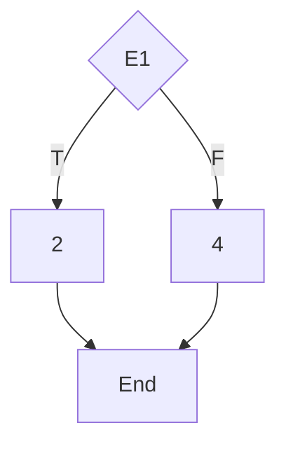

# Testing Simple Functions
## calculateMonthDays Function
### Dynamic White Box Unit Tests:
#### Condition
##### Cyclomatic Complexity:

##### Test Case Table:
| **\#case** | **Flow**      | **Condition**                     | **Input** | **Output** |
| ---------- | ------------- | --------------------------------- | --------- | ---------- |
| 1          | E1(T), 2, End | isLeapYear(year) && month == 2    | 2004, 2   | 29         |
| 2          | E1(F), 4, End | !(isLeapYear(year) && month == 2) | 2002, 2   | 28         |